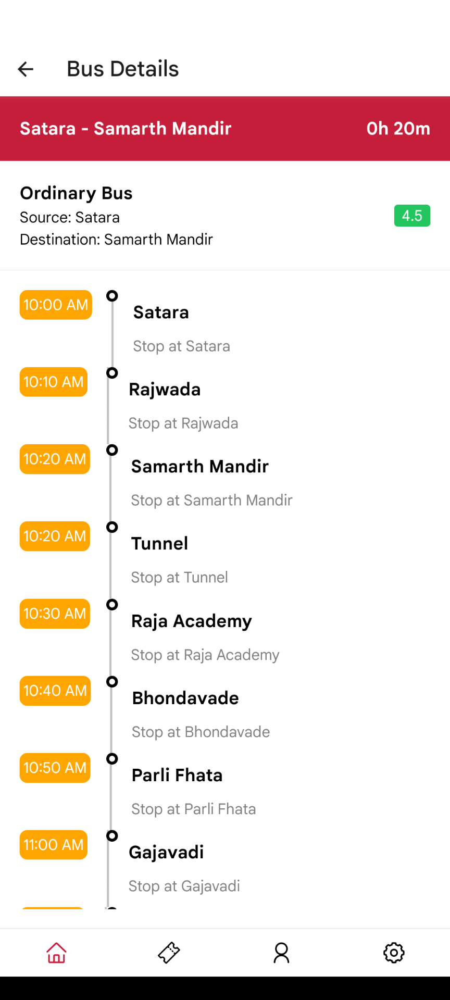

## Upcoming features | Open for contribution

- Access search result offline
- Implement path search result

<div style="display: flex; justify-content: center;">
    
    
    
</div>
<div style="display: flex; justify-content: center;">
    
    
    
</div>
<div style="display: flex; justify-content: center;">
    
    
    
</div>

## MSRTC Bus Timetable App

This repository contains the code for a final year project that aims to develop a mobile application using React Native
and Firebase. The project focuses on providing offline timetables of MSRTC buses in remote areas of Satara. The
application aims to improve the accessibility of bus schedules for users, even in areas with limited or no internet
connectivity.

## Table of Contents

- **About the Project**
- **Features**
- **Installation**
- **Usage**
- **Contributing**
- **License**

## About the Project

The MSRTC Bus Timetable App is a mobile application developed using React Native. It aims to address the challenges
faced by people in remote areas of Satara, where internet connectivity may be limited. The application allows users to
access and view MSRTC bus timetables even when offline. By leveraging Firebase's real-time database and synchronization
capabilities, the application ensures that users have the latest timetable information, which is automatically updated
whenever an internet connection is available.

## Features

- **Offline Timetables**: Users can access MSRTC bus timetables even without an internet connection.
- **Search Functionality**: Users can search for specific bus routes or stops to quickly find relevant timetable
  information.
- **User Authentication**: The application supports user authentication using Firebase Authentication for personalized
  experiences and additional features.
- **Accessibility**: The user interface is designed to be user-friendly and accessible to all users.

## Installation

To run the MSRTC Bus Timetable App locally, follow these steps:

1. Clone the repository to your local machine using the following command:

```
git clone https://github.com/thejunghare/msrtc-bus-timetable.git
```

2. Install the necessary dependencies using a package manager such as Yarn or npm:

```
cd msrtc-bus-timetable
yarn install
```

or

```
cd msrtc-bus-timetable
npm install
```

3. Set up a Firebase project and obtain the required Firebase configuration details (API keys, etc.) for your project.

4. Configure the Firebase credentials in the project by creating a firebaseConfig.js file in the project directory.
   Paste the Firebase configuration details into this file.

5. Run the application on a simulator/emulator or on a physical device using the following command:

```
yarn start
```

or

```
npm start
```

This will start the development server and provide instructions to launch the application on a device or emulator.

## Usage

Once the application is running, users can interact with the MSRTC Bus Timetable App on their mobile devices. They can
browse and search for bus routes or stops to view the corresponding timetables. The application automatically
synchronizes with Firebase when an internet connection is available, ensuring that users have the latest timetable
information.

## Contributing

Contributions to this repository are not accepted as the code provided is specific to the final year project. The usage
and distribution of the code are restricted. The code is shared here for reference purposes only.

## License

The code in this repository is provided under the Restricted License. The usage and distribution of the code, including
modification and redistribution, are strictly prohibited without explicit permission. Refer to the license file for more
information.
